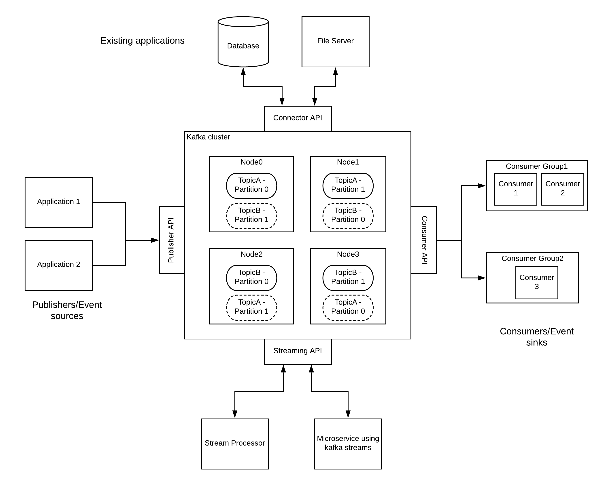

# آشنایی با کافکا
روز به روز استفاده از کافکا در حال افزایش است . بیش از ۸۰ درصد  شرکتهای فرچون ۱۰۰  از کافکا استفاده می کنند. بخشی از این شرکت ها شامل ده شرکت مسافرتی برتر ، هشت بانک از ده بانک برتر ، هشت شرکت ده شرکت بیمه برتر ، 9 شرکت از ده شرکت برتر مخابراتی و بسیاری دیگر هستند. لینکدین ، مایکروسافت و نت‌فلیکس با کافکا روزانه بیش از یک میلیارد پیام را  پردازش می کنند.

کافکا به عنوان یک استاندارد برای ساخت سیستم های مبتنی بر رویداد قابل 
اعتماد با حجم دیتا بالا تکامل یافته است. معماری منحصر به فرد و در عین حال ساده ، کافکا را به یک کامپوننت با کاربرد آسان تبدیل کرده است که به خوبی با معماری های موجود ادغام می شود. از نگاهی دیگر ، کافکا یک بستر پیام رسانی است که تولید کنندگان پیام را از مصرف کنندگان پیام جدا می کند و در عین حال قابلیت اطمینان پیام رسانی را در مقیاس به مصرف کنندگان ارائه می دهد. تولیدکنندگان پیام‌ها را به کافکا ارسال می کنند و کافکا در موجودیتهای  موسوم به تاپیک ذخیره می کند و پیام ها را به روشی مطمئن به یک یا چند مصرف کننده تحویل می دهد. 

## رابط‌های کافکا Kafka API
کافکا دارای چهار  رابط اصلی ، تولید کننده ، مصرف‌کننده ، استریمر و متصل کننده  است. بیایید یکی یکی در مورد آنها بحث کنیم:
### تولید کننده Producer:
تولید کننده نقش تولید دیتا در یک یا چند تاپیک کافکا را دارد. تولید کننده با رابط برنامه نویسی خود دیتاها را در کافکا ذخیره می‌کند.
### مصرف کننده یا consumer:
مصرف کنند با رابط برنامه نویسی خود با کافکا وصل شده و دیتاها را از یک یا چند تاپیک می‌خواند و ممکن دیتاها جدید در کافکا تولید کند.
### استریم Streams :
دیتاهای ذخیره شده در کافکا گاهی اوقات برای اهداف مختلف نیاز به  تغییر ، تجمیع یا همبستگی دارند.استریم‌ها برنامه‌های هستند که دیتاهای خود را از کافکا خوانده پردازش مورد نیاز را برروی آنها اعمال می‌کنند  و خروجی خود را در کافکا می‌نویسند.
### متصل کنند Conector:
متصل کنندها برنامه‌های از قبل توسعه یافته‌ای هستند که وظیفه انتقال دیتا از سیستم‌های دیگر به داخل کافکا را دارند مثلا متصل کننده‌ Mysql وظیفه انتقال تغییرات روی دیتابیس و جداول را به کافکا دارد.

## معماری کافکا
یکی از کتابهای که می‌تواند به درک شما از کافکا کمک کند، کتاب [Kafka: The Definitive Guide](https://www.confluent.io/resources/kafka-the-definitive-guide/) می‌باشد شما می‌توانید نسخه رایگان این کتاب را از لینک ذکر شده دریافت نمایید. 

در این قسمت به اصطلاحات زیر می‌پردازیم
 
- تاپیک و پارتیشن‌ Topic And Partition 
- خوشه و کارگزار در کافکا Cluster & Broker  

## تاپیک و پارتیشن‌ Topic And Partition
پیام ها در کافکا به تاپیک‌ها دسته بندی می شوند. نزدیکترین مقایسه برای تاپیک ، جدول پایگاه داده یا پوشه ای در سیستم فایل است. هر تاپیک به تعدادی پارتیشن تقسیم می شوند.پیام ها  در هر پارتیشن در انتهای آن نوشته می‌شوند و به ترتیب نوشتن پیام برای مصرف‌کنندگان در درسترس است.توجه داشته باشید که برای یک تاپیک به طور معمول چندین پارتیشن وجود دارد ، هیچ تضمینی برای مرتب سازی زمان پیام در کل تاپیک وجود ندارد و پیام‌ها فقط در یک پارتیشن مرتب شده هستند.شکل زیر تاپیکی با چهار پارتیشن را نشان می دهد که پیام‌های در آن درج شده است با چنین  روشی است که کافکا مقیاس پذیری را فراهم می کند. هر پارتیشن می تواند در یک سرور میزبانی شود ، به این معنی که یک تاپیک واحد می تواند به صورت افقی در چندین سرور توزیع شود تا عملکرد بهتر و توزیع شده‌ای را ارائه دهد.

## خوشه و کارگزار  Cluster & Broker
کافکا یک برنامه توزیع شده است و وظیفه دارد که در صورت بروز مشکل بار را بین کارگزارهای خود توزیع کند.یک سرور کافکا را کارگزار می نامند.کارگزار پیام های تولید کنندگان را دریافت می کند ،افستی (شناسه یکتای افزایشی) را به آنها اختصاص می دهد و پیام ها را به بر روی دیسک ذخیره می کند. کارگزاران همچنین به مصرف کنندگان سرویس می دهد و درخواست های مصرف کنندگان برای  واکشی پیام‌های ذخیره شده بروری دیسک را  می‌دهند . هر چند که کارایی یک کارگزار وابسته به سخت‌افزاری که برروی آن اجزا می‌شود دارد ولی  یک کارگزار به راحتی می تواند هزاران پارتیشن را اداره کندو میلیون ها پیام در ثانیه را پاسخگو باشد.
کارگزاران کافکا برای فعالیت به عنوان بخشی از یک خوشه طراحی شده اند. در یک مجموعه از کارگزاران ، یک کارگزار همچنین به عنوان کنترل کننده خوشه عمل می کند (که به طور خودکار توسط بقیه اعضا زنده انتخاب می شود). کنترل کننده مسئول امور جاری خوشه از جمله اختصاص پارتیشن به کارگزاران و نظارت بر خرابی کارگزاران می‌باشد. هر پارتیشن  به یک کارگزار در خوشه تعلق داردو آن کارگزار رهبر (Leader) آن پارتیشن نامیده می شود.یک پارتیشن ممکن است به چندین کارگزار اختصاص داده شود که منجر به این می شود که برای یک پارتیشن چندی افزونه Replication در نظر گرفته شود.در صورت بروز مشکل  کارگزار دیگری می تواند رهبری این پارتیشن را بر عهده بگیرد. در صورت بروز مشکل در یک کارگزار ، تمام مصرف کنندگان و تولیدکنندگان فعال به پارتیشن مورد نظر رهبر متصل شود.

برای اجرای یک خوشه کافکا می‌توانید به  [APACHE KAFKA QUICKSTART](https://kafka.apache.org/quickstart) مراجعه کنید و همچنین 
برای توسعه یک تولید کننده و مصرف کننده با استفاده از spring boot می‌توانید به [Spring Boot - Apache Kafka](https://www.tutorialspoint.com/spring_boot/spring_boot_apache_kafka.htm) مراجعه نمایید

